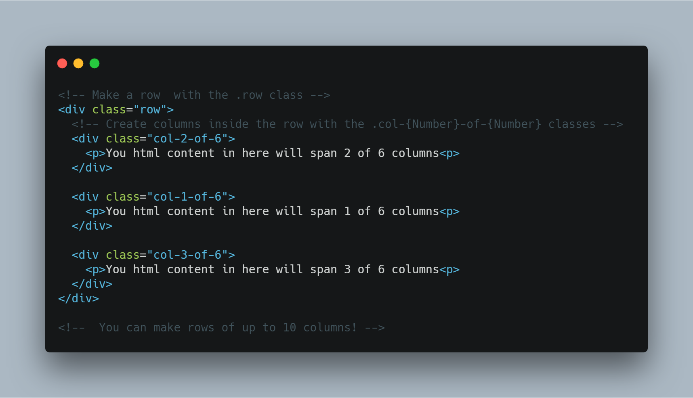

# gridify.css
A lightweight CSS library for creating  responsive layouts - aimed at bringing all the goodness of flexbox and the likes to older browsers


## Usage 
Using gridify is pretty straight-forward.

> Download gridify [here](https://adimvicky.github.io/gridify/css/gridify.css) and include it as a stylesheet in your HTML

> To create a row of columns, just create a ```<div>``` or (whatever block element that semantically suits it's content) and give it a ```row``` class.

> Inside of the element with the row class, nest elements with ```.col-{number}-of-{number}``` classes depending on how many columns you want each element to span. The first ```{number}``` is the number of columns you want the element to span. The second is how many columns you want in that row.

> The code snippet below probably describes it better.




## Contributing

If you'd like to contribute to gridify, then i'd be happy to look at your PR - here a few things you may need to know to get started.

I wrote gridify using [sass](https://sass-lang.com) and set up a build process for both production and development - (in the package.json) file.

You can clone gridify like so on your terminal - 

```$ git clone  https://github.com/adimvicky/gridify.css```

Next, You'd need to download the development dependencies for gridify.
Using your terminal, navigate into the folder you just cloned and run..

```$ npm install ```

That would download all the dev dependencies needed. You are all set up!

You can make any changes you want to in the ```sass``` folder.
During development, you should run ..

```npm run watch:sass```
This would compile the sass code and ouput the compiled css in the css/gridify.css file

Running..
```npm run build:css``` would compile, prefix (older browser support), minify the css code and save it in css/gridify.css

